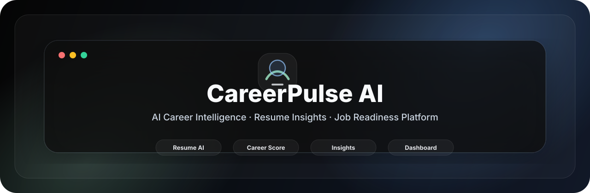
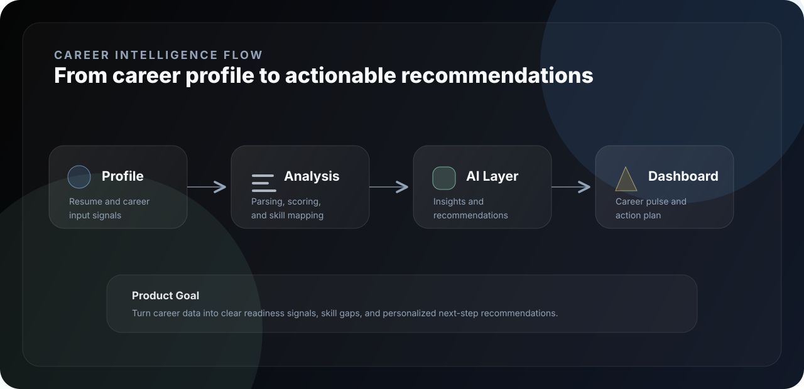
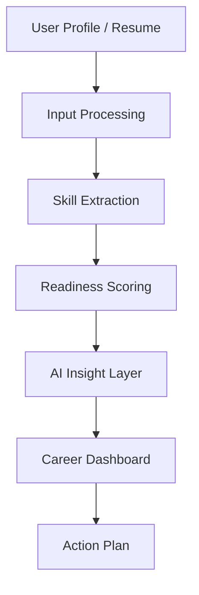

<div align="center">



<br />

<p>
  <strong>Analyze career signals.</strong> <strong>Score readiness.</strong> <strong>Recommend next steps.</strong>
</p>

<p>
  <code>AI Career Platform</code> · <code>Resume Intelligence</code> · <code>Skill Gap Analysis</code> · <code>Career Dashboard</code>
</p>

</div>

---

<div align="center">

<table>
<tr>
<td align="center" width="25%"><strong>Type</strong><br />AI Career App</td>
<td align="center" width="25%"><strong>Focus</strong><br />Readiness Insights</td>
<td align="center" width="25%"><strong>Experience</strong><br />Dashboard UI</td>
<td align="center" width="25%"><strong>Direction</strong><br />Job Intelligence</td>
</tr>
</table>

</div>

---

## 01 · Overview

<table>
<tr>
<td width="58%" valign="top">

### Career intelligence for skill-aware growth

CareerPulse AI is an AI-driven career readiness concept designed to convert profile data, resume signals, and skill indicators into clear insights for job preparation.

The product direction is a clean dashboard experience that helps users understand where they stand, what skills are missing, and what actions to take next.

</td>
<td width="42%" valign="top">

```text
┌──────────────────────────────┐
│  CAREER INTELLIGENCE         │
├──────────────────────────────┤
│  Input      Resume / Profile │
│  Analyze    Skills + Signals │
│  Score      Career Readiness │
│  Output     Insights + Plan  │
│  UI         Dashboard        │
└──────────────────────────────┘
```

</td>
</tr>
</table>

---

## 02 · System Flow



---

## 03 · Product Architecture



---

## 04 · Key Features

| Feature | Purpose |
|---|---|
| Resume intelligence | Extracts useful career signals from profile and resume data. |
| Skill gap analysis | Compares current skills against target career requirements. |
| Readiness scoring | Converts career signals into a clear progress indicator. |
| Recommendation flow | Suggests next steps for improving job readiness. |
| Dashboard experience | Presents insights in a clean, user-friendly interface. |
| Portfolio product direction | Positions the project as a modern AI career platform concept. |

---

## 05 · UI / UX Structure

<table>
<tr>
<td width="25%" valign="top">

### Input

Profile, resume, role target, and career preference capture.

</td>
<td width="25%" valign="top">

### Analysis

Skill extraction, scoring logic, and readiness interpretation.

</td>
<td width="25%" valign="top">

### Insight

AI-assisted feedback and personalized improvement areas.

</td>
<td width="25%" valign="top">

### Action

Clear next-step plan for learning, applying, and improving.

</td>
</tr>
</table>

---

## 06 · Tech Stack

> Exact stack should be documented after the application structure is finalized.

<table>
<tr>
<td width="25%" valign="top">

**Frontend**

Dashboard UI  
Responsive Layout

</td>
<td width="25%" valign="top">

**AI Layer**

Career Insights  
Resume Analysis

</td>
<td width="25%" valign="top">

**Data**

Profile Data  
Skill Signals

</td>
<td width="25%" valign="top">

**Product**

Career Scoring  
Recommendations

</td>
</tr>
</table>

---

## 07 · Installation

```bash
git clone https://github.com/ns7523/CareerPulse-AI.git
cd CareerPulse-AI
```

Install dependencies according to the detected project stack:

```bash
# JavaScript / frontend projects
npm install
npm run dev
```

```bash
# Python projects
python -m venv .venv
source .venv/bin/activate
pip install -r requirements.txt
```

---

## 08 · Usage

Recommended user flow:

```text
1. Add or upload resume/profile details
2. Select target role or career path
3. Run career analysis
4. Review readiness score and skill gaps
5. Follow recommended next steps
```

---

## 09 · Project Structure

```text
.
├── assets/
│   └── brand/
│       ├── hero.svg
│       └── system.svg
└── README.md
```

Recommended structure:

```text
.
├── assets/
│   ├── brand/
│   └── screenshots/
├── docs/
│   ├── architecture.md
│   ├── product-flow.md
│   └── deployment.md
├── src/
│   ├── components/
│   ├── pages/
│   ├── services/
│   └── utils/
├── data/
│   └── sample-profile.json
├── tests/
└── README.md
```

---

## 10 · Screenshots & Assets

<table>
<tr>
<td width="50%" valign="top">

### Landing Page

`assets/screenshots/landing.png`

Hero, product positioning, and call-to-action.

</td>
<td width="50%" valign="top">

### Dashboard

`assets/screenshots/dashboard.png`

Readiness score, skill gaps, and insights.

</td>
</tr>
<tr>
<td width="50%" valign="top">

### Resume Analysis

`assets/screenshots/resume-analysis.png`

Profile parsing and extracted career signals.

</td>
<td width="50%" valign="top">

### Recommendations

`assets/screenshots/recommendations.png`

Personalized career improvement plan.

</td>
</tr>
</table>

---

## 11 · Future Improvements

- [ ] Document exact application stack and setup commands.
- [ ] Add screenshots under `assets/screenshots/`.
- [ ] Add product architecture documentation.
- [ ] Add sample resume/profile input data.
- [ ] Add deployment workflow.
- [ ] Add test coverage for scoring and recommendation logic.
- [ ] Add a formal open-source license.

---

<div align="center">

### N S Akash

**AI & Cybersecurity Engineer**

[GitHub](https://github.com/ns7523) · [LinkedIn](https://www.linkedin.com/in/nsakash7523) · [Portfolio](https://nsakash.in) · [Email](mailto:nsakash752003@gmail.com)

</div>
