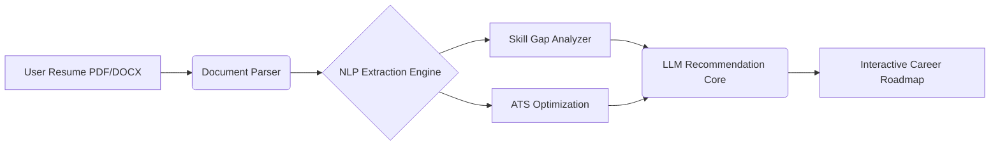

<div align="center">
  <br />
  
  <br />

  <h1 align="center">CareerPulse AI</h1>

  <p align="center">
    <strong>Next-Generation Resume Intelligence & Career Architecture Platform.</strong>
  </p>

  <p align="center">
    <a href="https://careerpulseai.streamlit.app"></a>
    
    
  </p>
</div>

<br />

## Overview

**CareerPulse AI** is an advanced AI-driven career guidance system engineered to automate and enhance the resume screening and preparation lifecycle. By leveraging Large Language Models (LLMs) and intelligent parsing heuristics, the platform systematically dissects resumes, identifies domain-specific skill gaps, and autonomously generates actionable improvement roadmaps for enterprise-level recruitment readiness.

### Engineering Significance
The system bridges the gap between raw applicant data and ATS (Applicant Tracking System) requirements. Utilizing advanced NLP pipelines, CareerPulse AI reconstructs career trajectories and provides dynamic, project-based interview simulations tailored specifically to the user's technical footprint.

<br />

## System Architecture



<br />

## Core Features

- **Algorithmic Resume Parsing**: High-fidelity extraction of skills, education matrices, projects, and certifications.
- **ATS Optimization Engine**: Autonomous detection of missing keywords and structural improvements to maximize ATS traversal rates.
- **Intelligent Career Routing**: Generates customized learning pathways (Beginner to Advanced) based on extracted skill topologies.
- **Simulated Interview Generation**: Dynamically constructs technical and HR interview batteries directly correlated to the candidate's parsed project data.
- **Skill Gap Diagnostics**: Real-time cross-referencing against modern industry technical requirements.

<br />

## Tech Stack

| Layer | Technologies |
| --- | --- |
| **AI / NLP Core** | OpenAI API, LLM Tooling, Custom Parsing Logic |
| **Backend Engine** | Python, FastAPI / Flask (or Node.js integration) |
| **Frontend Architecture** | Streamlit, HTML5, CSS3, JavaScript |
| **Data Persistence** | MongoDB / Firebase / MySQL |

<br />

## Quick Start

### Prerequisites
- Python 3.10+
- Valid LLM API Key (e.g., OpenAI)

### Local Deployment

```bash
# Clone the repository
git clone https://github.com/ns7523/CareerPulse-AI.git
cd CareerPulse-AI

# Install dependencies
pip install -r requirements.txt

# Configure environment
cp .env.example .env
# Edit .env to add your API keys

# Launch the platform
streamlit run app.py
```

<br />

## Future Roadmap

- [ ] Integration of real-time job market analytics scraping for dynamic skill weighting.
- [ ] Multi-agent architecture for automated mock technical interviews.
- [ ] Enterprise dashboard for bulk recruiter processing.

<br />

<div align="center">
  <br />
  <sub>Architected by <a href="https://github.com/ns7523">N S AKASH</a> • AI & ML Engineer</sub>
</div>
